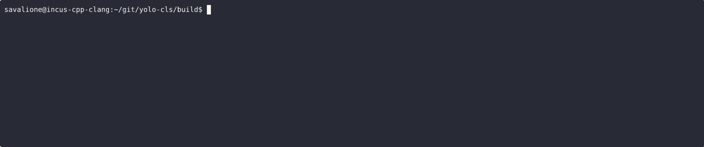
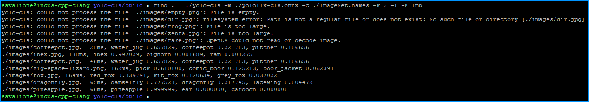

# yolo-cls


A high-performance, multi-threaded command-line tool for YOLO-based image classification using the ONNX Runtime.

`yolo-cls` is designed for speed and flexibility, allowing you to classify images provided as command-line arguments or piped from standard input, making it perfect for batch processing large collections of images.

## Features
* High Performance: Powered by the ONNX Runtime for optimized, cross-platform inference.
* Multi-threaded Processing: Classifies multiple images in parallel to fully utilize available CPU cores.
* Flexible Input: Accepts image file paths directly as arguments or from a pipe (`stdin`).
* Customizable Output: Control the number of top results to display (--top-k).
* Softmax Option: Optionally apply a softmax function to convert raw output scores into probabilities.
* Performance Timing: Measure and display the processing time for each image.
* Input Filtering: Filter input by file extension and maximum file size.

## Platform support
The project is officially tested and supported on the following platforms.
The 'Status' column indicates the level of support.

|Operating system|Architecture|Compiler  |Status   |Notes                                                              |
|:---------------|:-----------|:---------|:--------|:------------------------------------------------------------------|
|Linux           |`x86_64`    |GCC 13.3.0|Supported|                                                                   |
|Linux           |`aarch64`   |GCC 12.2.0|Supported|ONNX Runtime versions 1.22.0 and 1.21.0 didn't work, 1.20.1 worked.|
|Windows         |`x86_64`    |GCC 13.2.0|Supported|MinGW x64                                                          |

## Building
### Dependencies
Before you begin, ensure you have the following installed:
* A modern C++ compiler that supports C++17 (GCC, Clang, MSVC)
* [Git](https://git-scm.com/) (optional, for getting the source code)
* [CMake](https://cmake.org/) (version 3.20 or higher is recommended)
* [OpenCV](https://opencv.org/) (version 4.6.0 or higher is recommended).
* [ONNX Runtime](https://onnxruntime.ai/) (version 1.22.0 or higher is recommended, for `aarch64` version 1.20.1 is recommended).
* [Doxygen](https://www.doxygen.nl/) (optional, for documentation)

Note: You will likely need to install the ONNX Runtime manually, as shown below.

### Install ONNX Runtime
ONNX Runtime the official guide [ONNX Runtime - Getting started](https://onnxruntime.ai/getting-started).

The easiest way to ensure CMake can find the ONNX Runtime is to download the pre-built binary and place it in a known location:
1. Create a directory for the library: `mkdir ~/lib`
2. Navigate to the created directory: `cd ~/lib`
3. Download the ONNX Runtime:
    - (x86_64, Linux, CPU): `wget https://github.com/microsoft/onnxruntime/releases/download/v1.22.0/onnxruntime-linux-x64-1.22.0.tgz`
    - (x86_64, Linux, GPU): `wget https://github.com/microsoft/onnxruntime/releases/download/v1.22.0/onnxruntime-linux-x64-gpu-1.22.0.tgz`
    - (aarch64, Linux, CPU): `wget https://github.com/microsoft/onnxruntime/releases/download/v1.20.1/onnxruntime-linux-aarch64-1.20.1.tgz`
4. Unpack the archive: `tar -xvzf onnxruntime-linux-*.tgz`
5. The ONNX Runtime has been installed. Don't forget to let CMake find the installed library:
    - `-DCMAKE_PREFIX_PATH=~/lib/onnxruntime-linux-x64-1.22.0/`
    - Note: Change the path according to your installation

### Building
1. Clone the repository: `git clone https://github.com/SavaLione/yolo-cls.git`
2. Navigate to the project directory: `cd yolo-cls`
3. Create and enter a build directory: `mkdir build && cd build`
4. Configure the project with CMake: `cmake ..`
5. Compile the project: `make`

<!-- The executable `yolo-cls` (or `yolo-cls` on Windows) will be located in the `build` directory (or a subdirectory like `build/Release` depending on your generator and configuration). -->

## Getting a Model
This tool requires a YOLO classification model in ONNX format and a corresponding text file containing the class names.

## Usage


`yolo-cls` can process image files provided as arguments or piped from another command (like find or ls).

```
yolo-cls: A command-line tool for YOLO-based image classification.

usage: yolo-cls [options...] [image_file...]
       <command> | yolo-cls [options...]
```

Options:
|Short|Long              |Argument|Description                                              |Default                 |
|:----|:-----------------|:-----|:----------------------------------------------------------|:-----------------------|
|-m|--model              |<path>|**Required**. Path to the ONNX model file.                 |                        |
|-c|--classes            |<path>|**Required**. Path to the text file containing class names.|                        |
|-k|--top-k              |<int> |Number of top results to show.                             |5                       |
|-t|--threads            |<int> |Number of threads to use for classification.               |Number of hardware cores|
|-F|--max-filesize       |<size>|Maximum allowed filesize for images (e.g., 100mb, 2g).     |100mb                   |
|-T|--timing             |      |Enable printing processing time for each image.            |Disabled                |
|-S|--softmax            |      |Apply softmax to the output scores.                        |Disabled                |
|-D|--no-extension-check |      |Disable image file extension check (e.g., .jpg, .png).     |Disabled                |
|-h|--help               |      |Print this help message and exit.                          |                        |
|-v|--version            |      |Print version information and exit.                        |                        |
|-a|--about              |      |Print about information and exit.                          |                        |

### Examples:
Classify all images in a directory using `find`:
```bash
find . | ./yolo-cls -m model.onnx -c classes.txt
```


Classify all `.jpg` images in a directory using `find`:
```bash
find . -name "*.jpg" | ./yolo-cls -m model.onnx -c classes.txt
```

Classify a single image:
```bash
./yolo-cls -m yolov8n-cls.onnx -c imagenet.names -k 3 ./images/fox.png
```


Classify multiple images from arguments with timing info:
```bash
./yolo-cls -m model.onnx -c classes.txt -T ./img1.jpg ./img2.png ./img3.webp
```


## Contributing
Contributions are welcome!
We value a healthy and collaborative community.

Please read our [Contributing Guidelines](CONTRIBUTING.md) to get started.
All participants are expected to follow our [Code of Conduct](CODE_OF_CONDUCT.md).

## Documentation
This project supports Doxygen for code documentation.

To generate the documentation, navigate to the `./docs` directory and run:
```bash
doxygen doxyfile
```

The output will be generated in the `docs/documentation` directory.

## Licenses and Acknowledgements
This project is licensed under [The GNU General Public License v3.0](https://www.gnu.org/licenses/gpl-3.0.en.html).
See the [LICENSE](LICENSE) file for the full license text.

Copyright (C) 2025 Savelii Pototskii (savalione.com)

### Third-Party Libraries
This project incorporates code from several third-party libraries.
We are grateful to their developers and maintainers.
The full license texts for these libraries can be found in the `/licenses` directory.
* OpenCV - [Apache License 2.0](licenses/LICENSE-opencv.txt)
* ONNX Runtime - [MIT License](licenses/LICENSE-onnxruntime.txt)
* xgetopt - [zlib License](licenses/LICENSE-xgetopt.txt)
